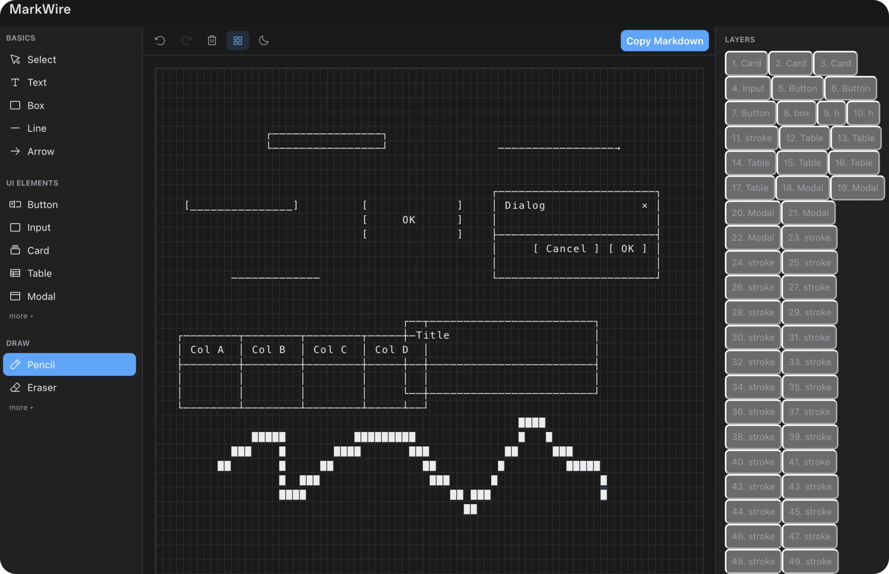
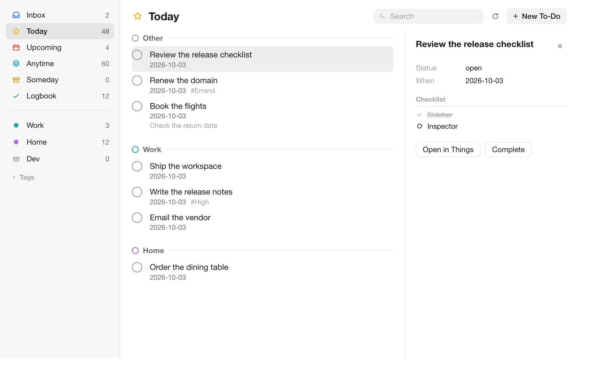

# openai-plugins

Portable [Agent Plugins](https://agent-plugins.org/specification) for ChatGPT and Codex, published by
[RetiredPhysicist](https://github.com/RetiredPhysicist).

| Plugin | Setup | Works in |
| --- | --- | --- |
| [all-search](./plugins/all-search) | None | Codex, ChatGPT |
| [dejavu-memory](./plugins/dejavu-memory) | One config block | Codex |
| [markwire](./plugins/markwire) | None | Codex |
| [things](./plugins/things) | Things 3 | Codex |

## Install

Requires Codex with plugin support and Node.js available as `node` on your `PATH`.

### GitHub

Share this repository link:

```text
https://github.com/RetiredPhysicist/openai-plugins
```

Install any plugin from it:

```bash
codex plugin marketplace add RetiredPhysicist/openai-plugins
codex plugin add markwire@retiredphysicist
codex plugin add things@retiredphysicist
```

Replace `markwire` with `all-search`, `dejavu-memory`, or `things` to install the others.

### Local checkout

For a copy you already have on disk:

```bash
codex plugin marketplace add /absolute/path/to/openai-plugins
codex plugin add markwire@retiredphysicist
```

**ChatGPT** — open the Plugins Directory, choose the **RetiredPhysicist** source, and install from
there. MarkWire is local-only, so its editor is available in Codex, not ChatGPT.

Installing is the whole setup for all-search. DejaVu needs one more step; see below.

## all-search

Nothing to configure. The plugin bundles a public AnySearch endpoint that answers anonymously, so
search works right after install at a shared rate limit.

To use your own quota, add a key to your Codex config:

```toml
[mcp_servers.anysearch]
url = "https://api.anysearch.com/mcp"
http_headers = { Authorization = "Bearer as_sk_..." }
```

## dejavu-memory

DejaVu runs on your own server, so this plugin needs to know where that server is. Add one block to
`~/.codex/config.toml`:

```toml
[mcp_servers.dejavu]
url = "https://your-dejavu.example.com/mcp"
http_headers = { CF-Access-Client-Id = "your-client-id", CF-Access-Client-Secret = "your-client-secret" }
```

Keep the `dejavu` name: it replaces the placeholder server the plugin ships with. The header pair is
only for deployments behind Cloudflare Access; a server without Access needs just `url`.

Set your server up first: [DejaVu](https://github.com/RealAlexandreAI/DejaVu).

**Why this is a manual step.** Three constraints rule out shipping a working default:

1. Each deployment has its own hostname, and the plugin format has no variable expansion for MCP
   URLs, so a shipped URL cannot be right for everyone.
2. Secrets would have to sit in the plugin package, which is public.
3. ChatGPT cannot send custom API keys or service tokens at all — it only speaks OAuth 2.1. A
   Cloudflare Access service token therefore works in Codex and not in ChatGPT.

Running DejaVu behind OAuth 2.1 instead of Access would make zero-config install possible in both
clients. That is the path to remove this step entirely.

## markwire

Nothing to configure and no remote service. Ask for a wireframe or call `open_wireframe`; MarkWire
ships a local stdio MCP server and a self-contained editor bundle.

The editor supports select, text, box, line, arrow, pencil, eraser, button, input, card, table,
modal, dropdown, toggle, tabs, layers, properties, undo, redo, clear, grid toggle, dark mode, canvas
sizes, and copy Markdown.



MarkWire also registers MCP App entrypoints, so Codex can surface it in the sidebar without a model
call: `thread` opens it as a content tab beside the current conversation, and `global` opens it
fullscreen from the primary sidebar.

MarkWire is an independent implementation inspired by the product idea of
[Mockdown](https://github.com/bbssppllvv/Mockdown). It does not include Mockdown source code.

Toolbar icons are inlined from [Phosphor Icons](https://phosphoricons.com) (MIT).

## things

Things opens your Things 3 data in a Codex workspace: Inbox, Today, Upcoming, Anytime, Someday,
projects, areas, tags, search, task details, quick add, and completion. It runs entirely on your
Mac — no account, no cloud service, and no background helper.



**Reads** go straight to the local Things database in read-only mode. **Writes** go through Things
itself using its URL scheme, and every write is read back before the tool reports success.

Install it like any other plugin, then open **Things** in the Codex sidebar:

```bash
codex plugin marketplace add RetiredPhysicist/openai-plugins
codex plugin add things@retiredphysicist
```

Requirements:

- macOS with Things 3 installed and opened at least once.
- Node.js 22.5 or later, because the plugin uses the built-in `node:sqlite` module.
- For updates, enable **Things → Settings → General → Enable Things URLs**, then **Manage** to turn
  on authentication. Adding and reading to-dos works without it; editing and completing need it.

Creating or renaming an area uses AppleScript, so macOS asks for automation permission the first
time. Reads and to-do writes never need that permission.

Things' automation surface cannot create repeat rules, cannot create standalone headings, and
cannot delete items. Use the Things app for those.

## Layout

Each plugin follows the v1.0.0 package model: a root `plugin.json` manifest, skills under `skills/`,
an `mcp.json` for bundled MCP servers, and OpenAI-specific metadata under `extensions.com.openai`.

```text
openai-plugins/
├── .agents/plugins/marketplace.json
└── plugins/
    ├── all-search/
    │   ├── plugin.json
    │   ├── mcp.json
    │   └── skills/research/SKILL.md
    ├── dejavu-memory/
    │   ├── plugin.json
    │   ├── mcp.json
    │   └── skills/remember/SKILL.md
    ├── markwire/
    │   ├── plugin.json
    │   ├── mcp.json
    │   ├── assets/
    │   ├── server/
    │   ├── skills/wireframe/SKILL.md
    │   └── ui/
    └── things/
        ├── plugin.json
        ├── mcp.json
        ├── assets/
        ├── server/
        │   ├── server.mjs
        │   └── src.mjs
        ├── skills/things/SKILL.md
        └── ui/
```

## License

MIT
